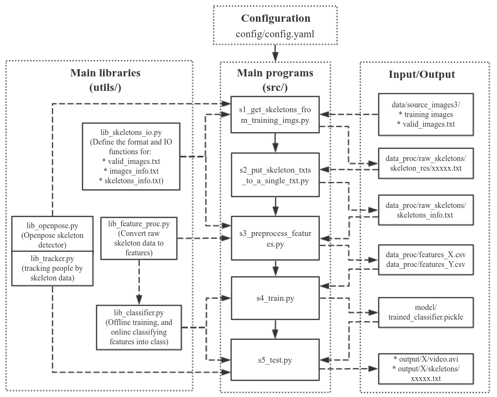

# Real-Time-Human-Action-Recognition-Using-Skeletal-Joint-Points

**Abstract**: The use of human action recognition has been gaining attention in recent years, particularly in the context of women and children for monitoring and improving safety in public spaces.
The study describes a real-time action detection system that extracts human skeletons from video frames using the OpenPose algorithm that can be used for distinguishing normal human activities and abnormal activities which could cause a threat.
Contemporary algorithms like OpenPose can accurately and quickly identify human skeletons even in challenging scenarios with obstacles and numerous people, and then the proposed system classifies data by extracting spatiotemporal characteristics from the positions of the skeleton's joints. 
In order to train and evaluate the performance of our proposed method, data acquisition consisting of 12073 samples that represent the diversity of real-world actions were collected and the system achieved an accuracy of 98.2%.

**Proposed Methodology**: The proposed work aims to identify Multi-Person Human Actions in real time that can distinguish a domain of actions such as (waving, walking, standing, squatting, jumping, running, and sitting) which are considered regular actions and (punching, kicking, and falling) which could be a cause of worry or threat. 
Each video frame is utilized to determine the location of 18 human skeletal joints using the OpenPose algorithm. It is utilized as raw input to extract features that can be used to categorize the actions being performed after the skeleton data has been extracted. 
The features from this skeletal data are extracted through preprocessing and used to feed into a classifier to create the final recognition result.
A deep neural network is used to categorize the actions into the desired domain in order to achieve this. Data acquisition consisting of 12073 frames extracted from videos that were recorded with a size of 640x480 and a framerate of 10 frames/second was done.

**Categories**: 
10 actions: Stand, Sit, Walk, Run, Jump, Squat, Fall, Punch, Wave and Kick; Multiple people (<=5) can be recognized; Real-time and multi-frame based recognition algorithm.

**Warning:** Since the 10 fps video and 0.5s-window  are used for training, you must also limit your video fps to about 10 fps (7~12 fps) if you want to test the pre-trained model on your own video or web camera. 

## The workflow of the algorithm is:
*  Get the skeletal joint's positions by [OpenPose](https://github.com/ildoonet/tf-pose-estimation).  
*  Track each person. Euclidean distance between the joints of two skeletons is used for matching two skeletons. 
See `class Tracker` in [lib_tracker.py](utils/lib_tracker.py)
*  Fill in a person's missing joints by these joints' relative pos in previous frame.  See `class FeatureGenerator` in [lib_feature_proc.py](utils/lib_feature_proc.py). So does the following.
*  Add noise to the (x, y) joint positions to try to augment data.
*  Use a window size of 0.5s (5 frames) to extract features.    
*  Extract features of (1) body velocity and (2) normalized joint positions and (3) joint velocities.
*  Apply PCA to reduce feature dimension to 80.  Classify by DNN of 3 layers of 50x50x50 (or switching to other classifiers in one line). See `class ClassifierOfflineTrain` in [lib_classifier.py](utils/lib_classifier.py)
*  Mean filtering the prediction scores between 2 frames. Add label above the person if the score is larger than 0.8. See `class ClassifierOnlineTest` in [lib_classifier.py](utils/lib_classifier.py)


# 1. Data Acquistition
Data consitiong of videos with 10 Types of actions was collected: `['stand', 'walk', 'run', 'fall', 'jump', 'sit', 'squat', 'kick', 'punch', 'wave']`. The total video lengths are about 20 mins, containing about 12073 video frames recorded at 10 frames per second.
The source images for training are stored here.

## Download data

Please download the data from
* Google driver: https://drive.google.com/open?id=1V8rQ5QR5q5zn1NHJhhf-6xIeDdXVtYs9
* or Baidu Cloud: https://pan.baidu.com/s/11M2isbEQnBTQHT3-634AHw

Unzip the data and you will see the folder: `source_images3`. Use it to replace the `data/source_images3`.

# 2. Install Dependency (OpenPose)
We need Python >= 3.6.

## 2.1. Download tf-pose-estimation

This project uses a OpenPose program developped by [ildoonet](https://github.com/ildoonet). The source project has been deleted. It has been forked here for the Tensorflow version 2.0: (https://github.com/gsethi2409/tf-pose-estimation.git)

Please download it:
```bash
export MyRoot=$PWD
cd src/githubs  
git clone https://github.com/gsethi2409/tf-pose-estimation.git
mv gsethi2409-tf-pose-estimation tf-pose-estimation
```

## 2.2. Download pretrained models
The mobilenet_thin models are already included in the project. No need to download. See folder:
```
src/githubs/tf-pose-estimation/models/graph✗ ls
cmu  mobilenet_thin  mobilenet_v2_large  mobilenet_v2_small
```

If you want to use the original OpenPose model which is named "cmu" here, you need to download it: 
```
cd $MyRoot/src/githubs/tf-pose-estimation/models/graph/cmu  
bash download.sh  
```

## 2.3. Install libraries
Basically you have to follow the tutorial of `tf-pose-estimation` project. If you've setup the env for that project, then it's almost the same env to run my project.

Step 1: Create a new virtual environment
```
conda create — name AIMachine
```

Step 2: Activate your virtual environment
```
conda activate AIMachine
```

Step 3: Install Python
```
conda install python==3.7.6
```

Step 4: Install the latest version of Tensorflow
```
conda install tensorflow
```
Optional reading: https://docs.anaconda.com/anaconda/user-guide/tasks/tensorflow/

Step 5: Create a new working directory and go into the folder.
```
mkdir myWorkspace
cd myWorkspace
```

Step 6: Clone the pose estimation repository.
```
git clone https://github.com/gsethi2409/tf-pose-estimation.git
```
Step 7: Enter the folder and install the requirements.
```
cd tf-pose-estimation
pip install -r requirements.txt
```
Step 8: Install SWIG
```
conda install swig
```
Step 9: Build C++ library for post-processing.
```
cd tf_pose/pafprocess
swig -python -c++ pafprocess.i && python3 setup.py build_ext --inplace
```
Step 10: Install OpenCV.
```
pip install opencv-python
```
Step 11: Install tf-slim library.
```
pip install git+https://github.com/adrianc-a/tf-slim.git@remove_contrib
```
Step 12: Download Tensorflow Graph File(pb file).
```
cd models/graph/cmu
bash download.sh
cd ../../..
```
Step 13: Run a quick test!
```
python run.py --model=mobilenet_thin --resize=432x368 --image=./images/p1.jpg
```
Step 14: Run a webcam test!
```
python run_webcam.py --model=mobilenet_thin --resize=432x368 --camera=0
```
Then install some small libraries used in the root project:
```bash
cd $MyRoot
pip3 install -r requirements.txt
```

## 2.4. Verify installation
Make sure you can successfully run its demo examples:
```
cd $MyRoot/src/githubs/tf-pose-estimation
python run.py --model=mobilenet_thin --resize=432x368 --image=./images/p1.jpg
```
If you encounter error, you may try to search in google or `tf-pose-estimation`'s issue. The problem is probably due to the dependency of that project.

# 3. Program structure

## Diagram



Trouble shooting:
  * How to change features?

    In [utils/lib_feature_proc.py](utils/lib_feature_proc.py), in the `class FeatureGenerator`, change the function `def add_cur_skeleton`! 
    
    The function reads in a raw skeleton and outputs the feature generated from this raw skeleton as well as previous skeletons. The feature will then be saved to `features_X.csv` by the script [s3_preprocess_features.py](src/s3_preprocess_features.py) for the next training step.

  * How to include joints of the head?

    You need to change the aforementioned `add_cur_skeleton` function. 
    
    I suggest you to write a new function to extract the head features, and then append them to the returned variable(feature) of `add_cur_skeleton`.

    Please read `def retrain_only_body_joints` in `utils/lib_feature_proc.py` if you want to add the head joints.

  * How to change the classifier to RNN?

    There are two major changes to do:
    
    First, change the aforementioned `add_cur_skeleton`. Instead of manually extracing time-serials features as does by the current script, you may simply stack the input skeleton with previous skeletons and then output it.

    Second, change the `def __init__` and `def predict` function of `class ClassifierOfflineTrain` in [utils/lib_classifier.py](utils/lib_classifier.py) to add an RNN model.


## Main scripts
The 5 main scripts are under `src/`. They are named under the order of excecution:
```
src/s1_get_skeletons_from_training_imgs.py    
src/s2_put_skeleton_txts_to_a_single_txt.py
src/s3_preprocess_features.py
src/s4_train.py 
src/s5_test.py
```

The input and output of these files as well as some parameters are defined in the configuration file [config/config.yaml](config/config.yaml). I paste part of it below just to provide an intuition:

``` yaml
classes: ['stand', 'walk', 'run', 'jump', 'sit', 'squat', 'fall', 'kick', 'punch', 'wave']

image_filename_format: "{:05d}.jpg"
skeleton_filename_format: "{:05d}.txt"

features:
  window_size: 5 # Number of adjacent frames for extracting features. 

s1_get_skeletons_from_training_imgs.py:
  openpose:
    model: cmu # cmu or mobilenet_thin. "cmu" is more accurate but slower.
    img_size: 656x368 #  656x368, or 432x368, 336x288. Bigger is more accurate.
  input:
    images_description_txt: data/source_images3/valid_images.txt
    images_folder: data/source_images3/
  output:
    images_info_txt: data_proc/raw_skeletons/images_info.txt # This file is not used.
    detected_skeletons_folder: &skels_folder data_proc/raw_skeletons/skeleton_res/
    viz_imgs_folders: data_proc/raw_skeletons/image_viz/

s2_put_skeleton_txts_to_a_single_txt.py:
  input:
    # A folder of skeleton txts. Each txt corresponds to one image.
    detected_skeletons_folder: *skels_folder
  output:
    # One txt containing all valid skeletons.
    all_skeletons_txt: &skels_txt data_proc/raw_skeletons/skeletons_info.txt

s3_preprocess_features.py:
  input: 
    all_skeletons_txt: *skels_txt
  output:
    processed_features: &features_x data_proc/features_X.csv
    processed_features_labels: &features_y data_proc/features_Y.csv

s4_train.py:
  input:
    processed_features: *features_x
    processed_features_labels: *features_y
  output:
    model_path: model/trained_classifier.pickle
```

For how to run the main scripts, please see the Section `4. How to run: Inference` and `6. How to run: Training`.

# 4. How to run: Inference

## Introduction
The script [src/s5_test.py](src/s5_test.py) is for doing real-time action recognition. 


The classes are set in [config/config.yaml](config/config.yaml) by the key `classes`.

The supported input includes **video file**, **a folder of images**, and **web camera**, which is set by the command line arguments `--data_type` and `--data_path`.

The trained model is set by `--model_path`, e.g.:[model/trained_classifier.pickle](model/trained_classifier.pickle).

The output is set by `--output_folder`, e.g.: output/.

The test data (a video, and a folder of images) are already included under the [data_test/](data_test/) folder.

An example result of the input video "exercise.avi" is:

```
output/exercise/
├── skeletons
│   ├── 00000.txt
│   ├── 00001.txt
│   └── ...
└── video.avi
```
Also, the result will be displayed by cv2.imshow().

Example commands are given below:

## Test on video file
``` bash
python src/s5_test.py \
    --model_path model/trained_classifier.pickle \
    --data_type video \
    --data_path data_test/exercise.avi \
    --output_folder output
```

## Test on a folder of images
``` bash
python src/s5_test.py \
    --model_path model/trained_classifier.pickle \
    --data_type folder \
    --data_path data_test/apple/ \
    --output_folder output
```

## Test on web camera
``` bash
python src/s5_test.py \
    --model_path model/trained_classifier.pickle \
    --data_type webcam \
    --data_path 0 \
    --output_folder output
```

# 5. Training data


## Download my data
Follow the instructions in [data/download_link.md](data/download_link.md) to download the data. Or, you can create your own. The data and labelling format are described below.

## Data format

Each data subfolder (e.g. `data/source_images3/jump_03-02-12-34-01-795/`) contains images named as `00001.jpg`, `00002.jpg`, etc.   
The naming format of each image is defined in [config/config.yaml](config/config.yaml) by the sentence: `image_filename_format: "{:05d}.jpg"`.

The images to be used as training data and their label are configured by this txt file: [data/source_images3/valid_images.txt](data/source_images3/valid_images.txt).  
A snapshot of this txt file is shown below:
```
jump_03-02-12-34-01-795
52 59
72 79

kick_03-02-12-36-05-185
54 62
```
In each paragraph,  
the 1st line is the data folder name, which should start with `"${class_name}_"`. 
The 2nd and following lines specify the `staring index` and `ending index` of the video that corresponds to that class.

Let's take the 1st paragraph of the above snapshot as an example: `jump` is the class, and the frames `52~59` & `72~79` of the video are used for training.

## Classes

The classes are set in [config/config.yaml](config/config.yaml) under the key word `classes`. No matter how many classes you put in the training data (set by the folder name), only the ones that match with the classes in **config.yaml** are used for training and inference.


# 6. How to run: Training

First, you may read
* Section `5. Training data`
* Section `3. Program structure`
* [config/config.yaml](config/config.yaml)

to know the training data format and the input and output of each script.

    ``` bash
    python src/s1_get_skeletons_from_training_imgs.py
    python src/s2_put_skeleton_txts_to_a_single_txt.py 
    python src/s3_preprocess_features.py
    python src/s4_train.py 
    ```

By default, the intermediate data are saved to [data_proc/](data_prco/), and the model is saved to [model/trained_classifier.pickle](model/trained_classifier.pickle).  
After training is done, you can run the inference script `src/s5_test.py` as described in Section `4. How to run: Inference`.

# 7. Result and Performance

The suggested framework is effective in differentiating between regular and aberrant acts carried out within the same frame. The prediction scores changed as the action shifted from Stand to Punch. Similar to this, the system accurately detects various actions and can identify up to 5-7 people in the frame. On the testing set, the accuracy of our suggested model is 98.2%

In this work, a human action recognition system has been developed that can distinguish 10 different kinds of actions consisting of normal and abnormal activities. This was implemented by using the OpenPose API to extract skeletal coordinate information (position), and then using this pose information to classify activities using a DNN Classifier. Data is collected from videos of 10 different actions which include normal (stand, walk, run, sit, squat, jump and wave) and violent actions (punch and kick). Five classification algorithms, k-Nearest Neighbors, Support Vector Machines (SVM) , SVM with kernel, Deep Neural Network and Random Forests were tested to find better results for our model. From the experiment results, it has been observed that DNN resulted in a higher accuracy. The proposed system is built on a real-time framework and uses skeletal data for feature extraction and classification. The recognition accuracy achieves up to 98.2% using a training set of over 12,000 samples. After training, actual videos were used to evaluate the action detection system. It regularly and correctly identified the actions on a video that was a perfect fit for our training set, and it also performed well on other videos. 

The experiment results on training KTH Dataset yielded good results in recognizing handwaving, jogging, running, and boxing. In addition, the proposed system preprocesses the data to account for missing critical body parts like the neck or thigh. When a joint is missing, the frame is often deleted or declared to be invalid. The recognition of human activity has been the subject of numerous research, but stronger measures must be adopted for widespread applications. Detecting all of the human activities performed in day-to-day life is challenging as it requires a very huge amount of training data but more activities can be added according to the application such as healthcare, military, intelligent surveillance system, human-computer interfaces and security.


